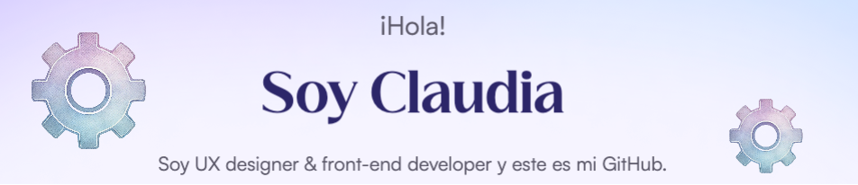

- 👋 Hola, soy @ClauCelis y tiendo puentes entre personas y tecnología ☺️
-  👀 Estoy interesada en aprender acerca de front-end y UX, por ahora.
- 🌱 Actualmente estoy aprendiendo de Vue, JS, otros temas básicos
- Soy psicóloga, arteterapeuta y diseñadora UX... re loco, no? Actualmente, estoy abierta a ofertas laborales y a desarrollar los proyectos de UX y/o Front-end que tengas en mente.
- 🐶🐶🐶 Tengo 3 perrunos 💜
- De 🇨🇱 para el 🌎  

 **¡Contáctame en LinkedIn!**  
  

**¿Por qué deberías contactarme?**
Conjugo saberes y disciplinas que son el mejor complemento y aseguran buenos resultados en la interacción/comunicación digital:

- Psicóloga laboral PUC.
- Diplomada de Metodologías de investigación cuantitativa en Cs. Sociales en la Universidad de Chile.
- Magister en arteterapia, UDD.
- Diplomada UX/UI USACH.
- Front-end developer de Talento Digital. 

¿Extraño? ¡No! Cada experiencia alimenta los mundos diversos que viven dentro de mí y me permiten hablar al mundo que es cada usuario.
La investigación es mi mayor fortaleza y eso mismo permite que **aprenda rápidamente de cada proceso**, contexto y objetivo en un proyecto.

## Skills

 
 
 
 
 
 
 
 
 

UX designer

  
  
  

 

